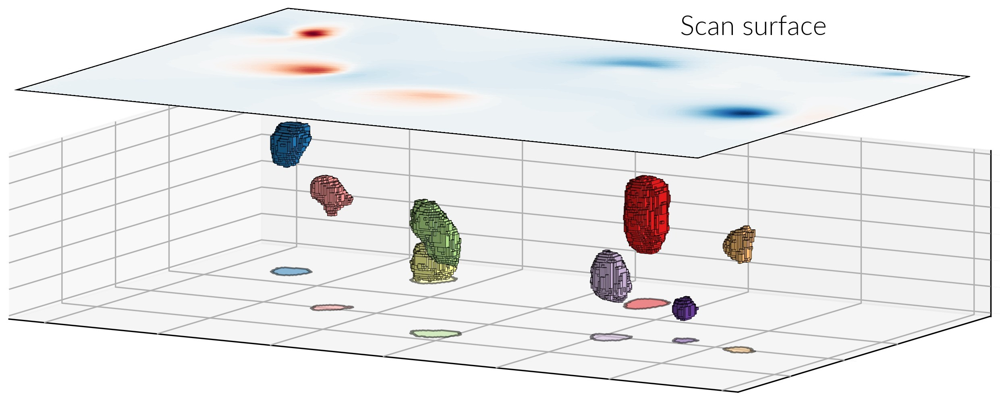

.. dipole_inverse documentation master file, created by
   sphinx-quickstart on Thu Nov  4 16:33:00 2021.
   You can adapt this file completely to your liking, but it should at least
   contain the root `toctree` directive.

Dipole Inverse - Cuboid model numerical inversion
=================================================

|

This is the documentation for the `dipole_inverse` library. This Python module
allows to perform numerical inversions from magnetometry scan data into grains
modeled as cuboids. Grain geometries and locations are obtained from microCT.
The main class of this library is the `Dipole` class that accepts the
measurement data and has the necessary methods to obtain inverted
magnetizations.

.. autoclass:: dipole_inverse.Dipole

The `QDM_data` and `cuboid_data` parameters are passed as text files. The data
from the QDM is formatted as a :math:`NxN` matrix where every element is the
out of plane component of the total field passing through a sensor scan whose
position is defined by the `QDM_*` parameters. The data from the microCT is
given as a 6 column text table referring to the geometry and location of the
cuboids defining the grain profiles. The cuboids are generated from a
voxel-aggregation algorithm applied to the raw tomographic data, which results
in largest possible cuboids to describe a grain profile. The `cuboid_data`
files requires the following entries::

    x y z dx dy dz index

Columns 1-3 are the cuboid positions, 4-6 are the cuboid edge lengths and the
`index` is an integer number referring to the grain (label) where the cuboid
belongs.

A tutorial is provided in the :doc:`tutorial/tutorial` section.

Detailed documentation of every method in the `Dipole` class and functions to
plot the data analyzed with this library can be found in the
:doc:`source/index` section.

.. toctree::
   :maxdepth: 1
   :hidden:

   tutorial/tutorial.ipynb
   source/index

Indices and tables
==================

* :ref:`genindex`
* :ref:`modindex`
* :ref:`search`
